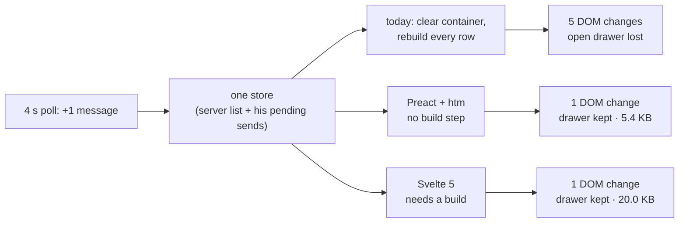

# Issue #233 spike: which framework for the Nova app

One Nova surface, the chat thread, written three ways against the same store. `npm i && npm run measure` reproduces every number here.

| | Today's pattern | Preact + htm | Svelte 5 |
|---|---|---|---|
| Bytes for the surface, minified + gzip | 415 | **5,400** | 20,000 |
| Build step | none | **none** | required |
| Message 1's DOM node survives a poll | no | yes | yes |
| Open drawer on message 1 survives a poll | no | yes | yes |
| DOM changes for one new message | 5 | 1 | 1 |
| Sent message survives a stale poll | yes | yes | yes |
| ...with a store that does not keep pending sends | **no** | **no** | **no** |

**Recommendation: Preact + htm, no build step, chat thread first.** It fixes the flash and the lost-state class of bug exactly as well as Svelte in this test, at a quarter of the bytes, and it keeps the app buildless, so the deploy path does not change. `render()` mounts into any existing element, so one surface can move at a time inside today's `index.html`.

**The vanishing message is not a framework bug.** The last two rows are the control: with a store that drops his pending send when a poll lands, all three renderers lose it. Keyed diffing stops the flash; only the store merge stops the vanish. The migration has to carry that merge, whichever framework it uses.

## What this did not measure

- Cold load on a real phone. Neither pod has a browser, so these are bytes, not seconds.
- React, Vue and SolidJS. The issue shortlists five; this built two.
- Svelte through Vite. This is esbuild with the `production` condition; a Vite build may come out smaller.
- The real thread: no steps, markdown, loaders or scroll. It is the part of the surface where the reported bugs live.
- Scale of the job: `app.js` has 72 `render*` functions and 96 `textContent = ""` teardowns.
